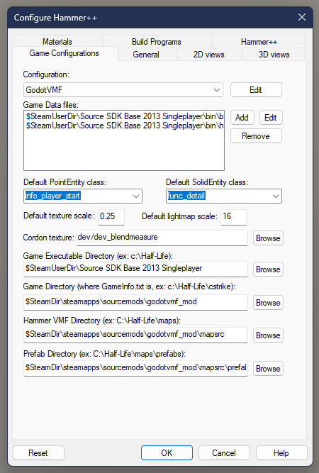

# Installation
Move the `addons/godotvmf` folder into the same folder of your project and activate it in your project settings.

## Hammer configuration
1. Download Source SDK Base 2013 Singleplayer

2. Download [Hammer++](https://ficool2.github.io/HammerPlusPlus-Website/) and put all files into `SteamFolder/steamapps/common/Source SDK Base 2013 Singleplayer/hl2/bin`

3. Download [the blank mod folder](https://drive.google.com/drive/folders/1Vitm-praILoZvS5oDnv6yxtsW7pLSBtq) and put it inside `SteamFolder/steamapps/sourcemods/<ProjectName>`

4. Launch Hammer++ and configure it (Tools -> Options) as on the picture below



5. You're all set!

## Config file
Before work with the plugin create in the root of the project a file `vmf.config.json`.

Default config:  
```json
{
	"gameInfoPath": "C:/Steam/steamapps/sourcemods/mymod",
	"mdl2obj": "res://mdl2obj/mdl2obj.exe",
	"vtfcmd": "res://vtfcmf/vtfcmd.exe",

	"import": {
		"scale": 0.025,
		"generateCollision": true,
		"generateLightmapUV2": true,
		"lightmapTexelSize": 0.4,
		"instancesFolder": "res://examples/instances",
		"entitiesFolder": "res://examples/entities",
		"geometryFolder": "res://examlpes/geometry"
	},

	"models": {
		"import": true,
		"generateCollision": true,
		"lightmapTexelSize": 0.4,
		"targetFolder": "res://examples/models"
	},

	"material": {
		"importMode": 1,
		"ignore": [
			"TOOLS/*",
			"light/white",
			"*/water_*"
		],
		"fallbackMaterial": null,
		"defaultTextureSize": 512,
		"targetFolder": "res://examples/materials"
	}
}
```

- `gameInfoPath` - The source mod path where resources placed to work with hammer.
> One advice for game development by using Hammer. Create a blank mod for Source, place all resources you need (basically it will be models and materials) for your game and setup Hammer. Yea, you will need to convert all textures into VTF format to get it visible inside Hammer.

- `mdl2obj` - Path to [MDL2OBJ](/mdl2obj) utility. Used in case you need to move models from the mod's folder. Required in case of `models.import` is `true`.
- `vtfcmd` - Path to [VTFCmd](https://nemstools.github.io/files/vtflib132-bin.zip) utility. Used in case you need to sync the mod folder materials with the project's materials. Required in case of `material.importMode` is `3`.

- `import`
    - `scale` - In case you need to convert Valve's metrics to yours.
    - `generateCollision` - If `true` then generates `CollisionShape3D` for imported geometry (except brush entities) by using trimesh shape.
	- `generateLightmapUV2` - If `true` then generates UV2 to enable light baking.
	- `lightmapTexelSize` - Size of each texel in the lightmap for more precise light baking (use with caution, very low values can cause crash).
    - `instancesFolder` - Path inside the project where imported instances be placed.
    - `entitiesFolder` - Path inside the project where importer will grab entities during import.
	- `geometryFolder` - Path where the importer will store any mesh or collision resource that is generated.
- `models (optional)`
    - `import` - If `true` then importer will try to import models from the mod's folder.
    - `generateCollision` - If `true` then generates `CollisionShape3D` for imported geometry.
    - `lightmapTexelSize` - If `true` then generates UV2 for static props for light baking (global default value, can be overridden by eponymous keyvalue in `prop_static` entity, which can be manually added using `Add` button in object properties).
    - `targetFolder` - Path inside the project where imported models be placed.
- `material`
    - `importMode` - The mode of importing materials
        - 0 - Do nothing
        - 1 - Collate by name - Use materials that already exists in the project. Otherwise the fallback material will be used.
        - 2 - Import directly from mod folder. Already imported materials will be ignored.
        - 3 - Sync mod folder materials with the project. It will create new materials and update existing ones in the mod folder.
            - Requires VTFCmd utility to be defined in the config.
    - `ignore` - List of materials that should be ignored during import.
    - `fallbackMaterial` - Path to the material *.tres that will be used as a fallback for ignored materials.
    - `defaultTextureSize` - The size of the texture that will be used in case of missing texture.
    - `targetFolder` - Path inside the project where imported materials be placed.
