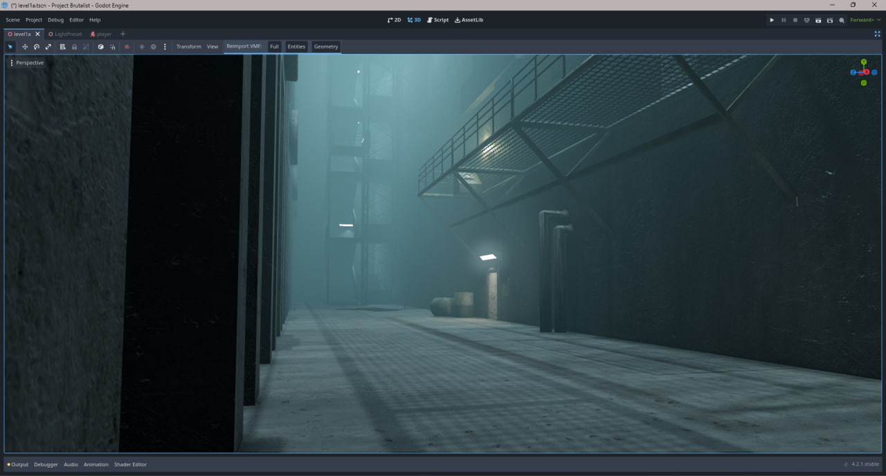
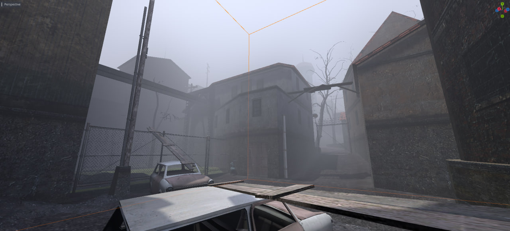

# GodotVMF

An importer of VMF files into Godot.  
Useful instrument for people who used to work with Hammer and finds it most comfortable tool for level geometry creation.  
  
Highly recommend to use [Hammer++](https://ficool2.github.io/HammerPlusPlus-Website/) since it support precised vertex data that allows you use concave brushes.

## Why?
We with my friend @Ambiabstract didn't found any comfortable solution of 3D level design for Godot so we decided to create our own :)

## Usage
- [Docs](docs/readme.md)

## Features
- Import geometry (Also with smoothing groups)
- Entities support
- Hammer's I/O  system support
- Model import support
  - Requires 3rd party utility [MDL2OBJ](/mdl2obj) (included in the repository)  
- Material import support
- Instances support
- Displacements with vertex alpha
	- WorldVertexTransition materials (blend textures) will be imported as [`WorldVertexTransitionMaterial`](/addons/godotvmf/shaders/WorldVertexTransitionMaterial.gd)
- Native VTF import
  - Supported VTF formats: DXT1, DXT3, DXT5

## Known issues
- Extraction materials and models from VPKs is not supported
- Entities in instances importing not completely. You'll need to open the instance scene and reimport it.
- Wasn't tested on MacOS
- Some of imported models may have wrong orientation

## Contribution
If you have some ideas, suggestions regarding to quality or solutions of the problems above, feel free to contribute!

## Additional things
- Source code of MDL2OBJ: https://github.com/H2xDev/mdl2obj
- Demo: https://www.youtube.com/watch?v=5XYfvbIAlJU
- The project I work using this tool: https://github.com/h2xdev/sixside
	- There're lots of examples of implementation of entities in there.
	- The code base is not polished well so don't judge me :'C

## Special thanks
[@Ambiabstract](https://github.com/Ambiabstract) - help and inspiration  
[@Lachrymogenic](https://github.com/Lachrymogenic) - test on linux and performance test  
[@SharkPetro](https://github.com/SharkPetro) - materials test  

## Showcase
|||
|-|-|
|||

## License
MIT
