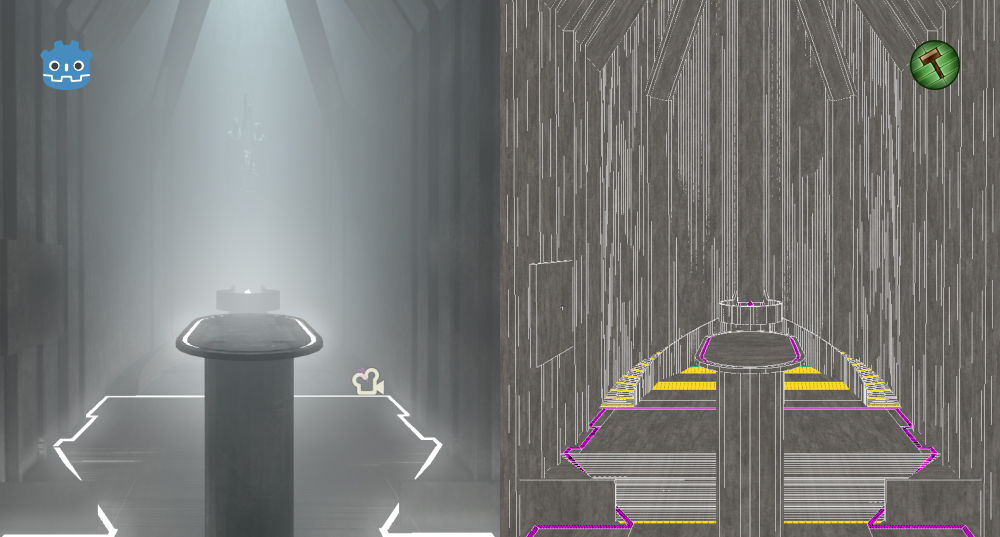

# GodotVMF
**THIS PROJECT STILL IN ACTIVE DEVELOPMENT THERE MIGHT BE BUGS**  
  
An importer of VMF files into Godot.  
Useful instrument for people who used to work with Hammer and finds it most comfortable tool for level geometry creation.  
  
Highly recommend to use [Hammer++](https://ficool2.github.io/HammerPlusPlus-Website/) since it support precised vertex data that allows you use concave brushes.

## Why?
We with my friend @Ambiabstract didn't found any comfortable solution of 3D level design for Godot so we decided to create our own :)

## Usage
- [Docs](docs/readme.md)

## Features
- Import geometry (Also with smoothing groups)
- Entities support
- Hammer's I/O  system support
- Model import support*
- Material import support**
- Instances support

\* - Requires 3rd party utility [MDL2OBJ](/mdl2obj) (included in the repository)  
\** - Requires 3rd party utility [VTFLib](https://nemstools.github.io/subpages/Comments/VTFLib_v1.3.2_Full.html)

## Known issues
- Displacements are not supported yet
- Extraction materials and models from VPKs is not supported
- Entities in instances importing not completely. You'll need to open the instance scene and reimport it.
- Wasn't tested on MacOS
- Tested only on 4.1+
- For materials it imports only albedo texture

## GodotVMF elsewhere
* [Reddit](https://www.reddit.com/r/godot/comments/1ax4b7h/godotvmf_use_valve_hammer_editor_for_level/)
* [Asset Library](https://godotengine.org/asset-library/asset/2605)
* [Discord](https://discord.gg/VTmDjUuP)

## Contribution
If you have some ideas, suggestions regarding to quality or solutions of the problems above, feel free to contribute!

## Additional things
- Source code of MDL2OBJ: https://github.com/H2xDev/mdl2obj
- Demo: https://www.youtube.com/watch?v=5XYfvbIAlJU

## Special thanks
[@Ambiabstract](https://github.com/Ambiabstract) - for help and inspiration

## License
MIT
